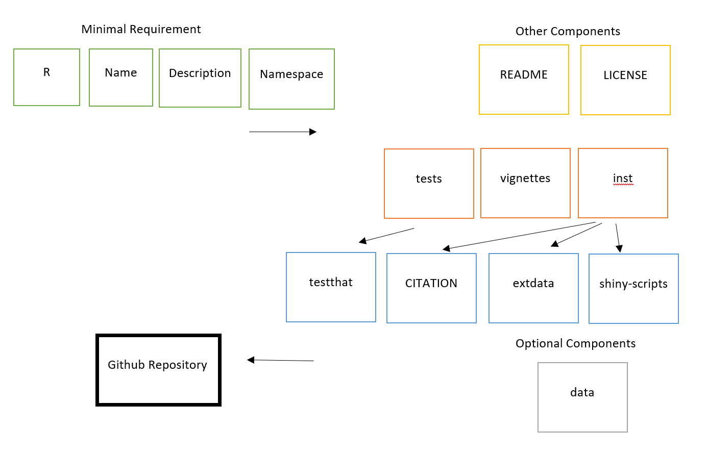

<!-- README.md is generated from README.Rmd. Please edit that file -->

# commonTFfinder

<!-- badges: start -->
<!-- badges: end -->

## Description

The goal of commonTFfinder is to identify common transcription factor
(TF) binding sites among different genes from user provided ChIP-seq
data. This package is intended to compare sequences of interest from
ChIP-seq data. However, some functions have not been developed, so only
certain types of analysis are possible.

## Installation

You can install the development version of commonTFfinder from
[GitHub](https://github.com/) with:

``` r
# install.packages("devtools")
devtools::install_github("RochelleRuoxuanWang/commonTFfinder")
library("commonTFfinder")
```

To run the Shiny app:

``` r
runTestingPackage()
```

## Overview

``` r
ls("package:commonTFfinder")
data(package = "commonTFfinder")
```

The \*\* function.  

The package also contains an ChIP-seq data set cstest. Refer to package
vignettes for more details.

``` r
browseVignettes("commonTFfinder")
```



## Contributions

The author of the package is Rochelle (Ruoxuan) Wang. Other packages
used include GenomicRanges, as detailed in the References section below.

## References

Lawrence M, Huber W, Pages H, Aboyoun P, Carlson M, et al. (2013)
Software for Computing and Annotating Genomic Ranges. PLoS Comput Biol
9(8): e1003118. <doi:10.1371/journal.pcbi.1003118>

## Acknowledgements

This package was developed as part of an assessment for 2021 BCB410H:
Applied Bioinformatics, University of Toronto, Toronto, CANADA.
